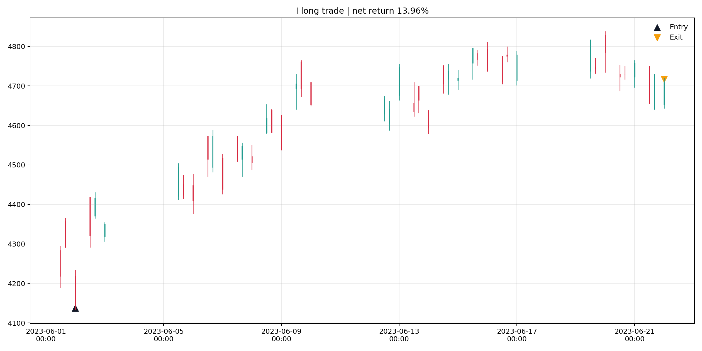
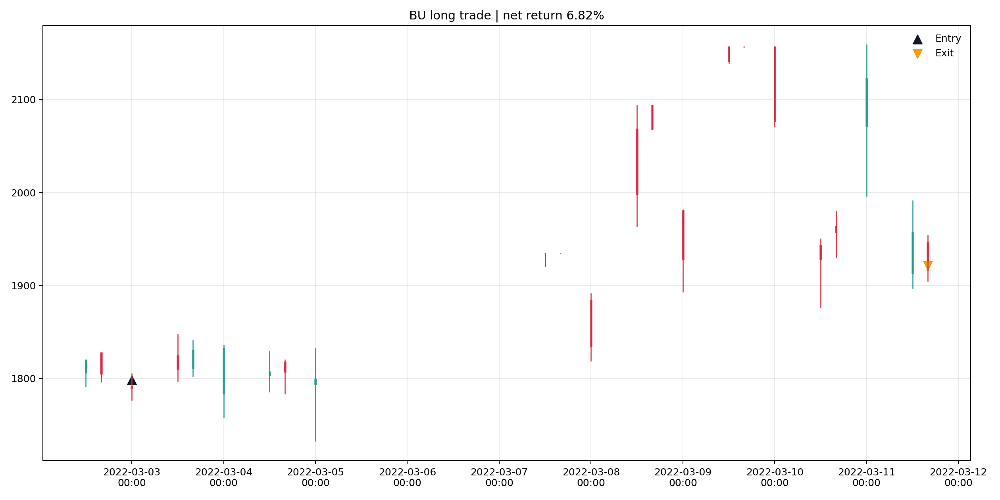
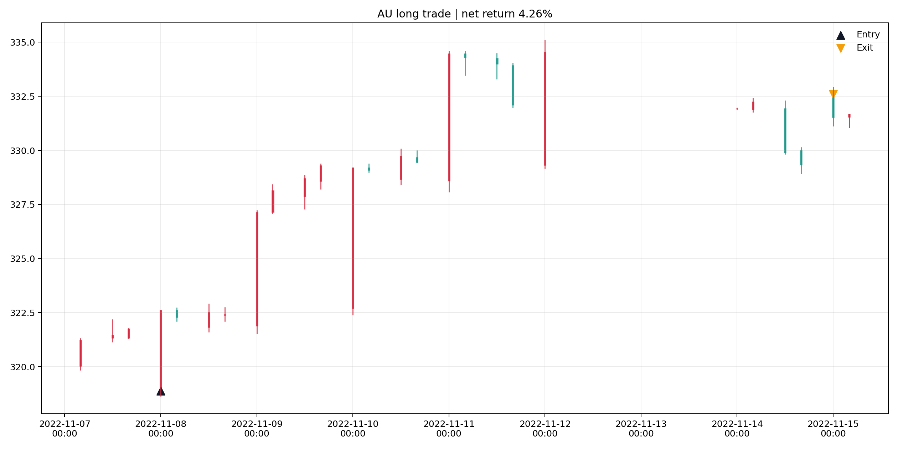

# CTA Problem 1 Backtest Report

## 1. Strategy logic

- Strategy type: medium-frequency trend-following breakout on each futures symbol independently.
- Signal bar: `240min` aggregated from 1-minute data using only `hfq_*` prices.
- Long entry: `240min` close breaks above the previous `16` bars' highest close, while fast EMA stays above slow EMA and efficiency ratio >= `0.15`.
- Short entry: symmetric downside breakout with the same trend-strength filter.
- Exit: previous `8` bars' breakout failure or fast/slow EMA trend reversal.
- Execution: signals are generated after the signal bar closes; fills use the next available 1-minute `hfq_twap`.
- Cost assumption: open and close both charge `万分之2 = 0.0002` per side.
- Parameter policy: fixed heuristic parameters, no in-sample / out-of-sample parameter optimization.

## 2. Portfolio metrics

```text
Sharpe ratio: 2.289
Annualized return: 19.52%
Max drawdown: -4.04%
Calmar ratio: 4.834
Win rate: 48.68%
Win/loss ratio: 1.782
Number of transactions: 2044
Average holding time (hours): 150.57
Average profit/loss per transaction: 0.5778%
```

Year-by-year portfolio metrics:

```text
period sharpe annualized_return max_drawdown  number_of_transactions
  2022  2.006            21.25%       -4.04%                    1025
  2023  2.947            39.26%       -1.84%                    1019
```

## 3. Symbol cross-section

Top 5 symbols by Sharpe:

```text
symbol sharpe annualized_return max_drawdown  number_of_transactions
     I  2.300            62.80%      -10.11%                      53
    SA  2.219            68.34%      -12.66%                      52
    RB  2.001            35.72%       -5.14%                      58
     V  1.712            28.41%       -6.76%                      49
    HC  1.591            27.65%       -6.61%                      68
```

Bottom 5 symbols by Sharpe:

```text
symbol sharpe annualized_return max_drawdown  number_of_transactions
    BU -0.189            -4.56%      -26.82%                      64
    AL  0.037             0.57%      -13.90%                      86
    AU  0.074             0.68%      -10.05%                      88
    EG  0.076             1.56%      -19.04%                      68
    FU  0.151             4.97%      -27.18%                      64
```

## 4. Simple analysis

- Cross-section strongest symbols in this run: I, SA, RB, V, HC.
- Cross-section weakest symbols in this run: BU, AL, AU, EG, FU.
- The strategy works best when a symbol develops persistent directional expansion after consolidation, because the breakout plus EMA alignment filter keeps it in sustained moves and cuts many noisy reversals.
- The strategy struggles in tight oscillating ranges and fast V-shaped reversals, where repeated channel failures still trigger a few stop-and-reverse trades.
- The equal-weight portfolio benefits from diversification across sectors because single-symbol equity curves are uneven, but the aggregate curve becomes materially smoother than many standalone symbols.

## 5. Output files

- `charts/symbol_equity_curves.png`: all selected symbols' daily equity curves.
- `charts/portfolio_equity.png`: equal-weight portfolio equity curve.
- `symbol_metrics.csv`: per-symbol performance table.
- `portfolio_metrics.csv`: portfolio summary metrics.
- `all_trades.csv`: all completed trades.

## 6. Representative trade charts






